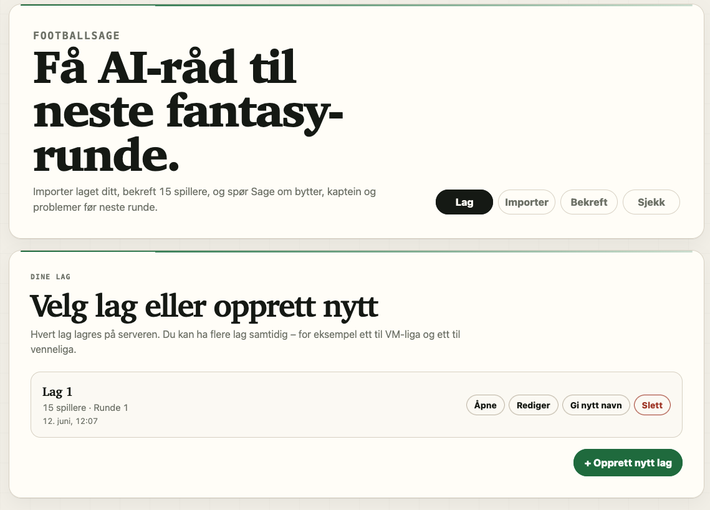
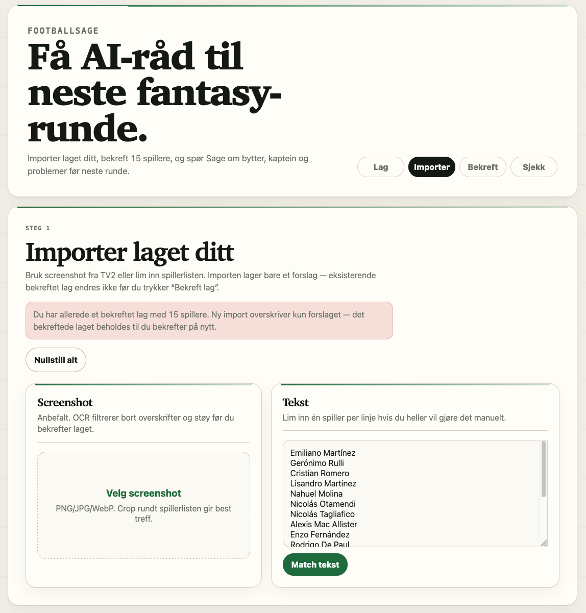
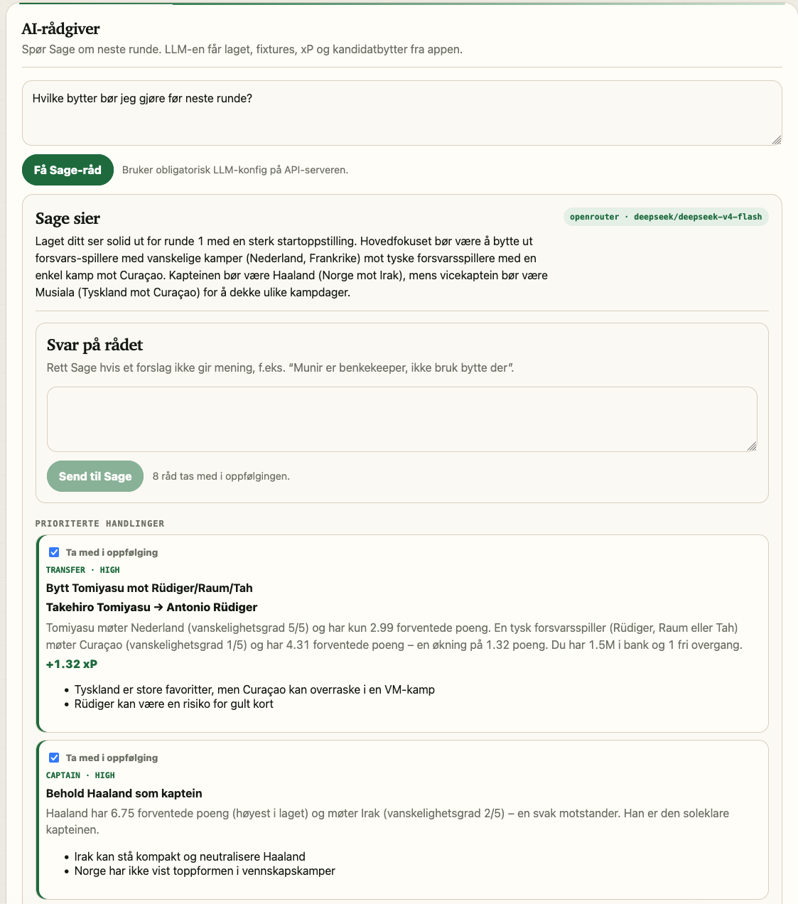

# FootballSage

Selvhostet AI-rådgiver for FIFA World Cup Fantasy 2026.

FootballSage lar deg importere fantasy-laget ditt fra tekst eller screenshot, sjekker laget mot reglene, lagrer flere lag server-side, og bruker en LLM til å foreslå bytter, kaptein og risikopunkter før neste runde.

## Hva du får

- Webapp for desktop og mobil
- Import fra tekst eller screenshot
- Lag-sjekk mot fantasy-regler
- Flere lag lagret på serveren
- AI-råd via OpenRouter/OpenAI/Anthropic-kompatibel konfig
- Ferdigbygde Docker-images på GHCR uten lokal Python/pnpm-installasjon
- API-et er internt; browseren bruker samme-origin `/api/...`

## Screenshots

### Start / lagvelger



### Import og bekreftelse



### AI-råd fra Sage



## Quickstart

Krever kun:

- Docker
- Docker Compose
- En LLM API-key hvis du vil bruke Sage-råd/OCR

```bash
git clone https://github.com/ovestokke/footballsage.git
cd footballsage

cp example.env .env
# Rediger .env og fyll inn OPENROUTER_API_KEY eller annen støttet LLM-key.

docker compose pull
docker compose up
```

Åpne:

```text
http://localhost:3000
```

På en annen enhet på samme nettverk:

```text
http://<server-ip>:3000
```

## Konfigurasjon

Minimum for AI-råd:

```env
NEXT_PUBLIC_API_BASE_URL=/api
SAGE_LLM_PROVIDER=openrouter
SAGE_LLM_MODEL=deepseek/deepseek-v4-flash
OPENROUTER_API_KEY=sk-or-v1-...
```

Valgfri web-port:

```env
WEB_PORT=3000
```

Start på annen port:

```bash
WEB_PORT=3010 docker compose up
```

`.env` er gitignoret. Ikke commit API-nøkler.

Uten LLM-konfig starter appen fortsatt, men Sage-råd og screenshot-OCR vil returnere konfig-feil.

## Docker-oppsett

Default `compose.yaml` bruker 4 ferdigbygde images fra GitHub Container Registry:

```text
ghcr.io/ovestokke/footballsage-worldcup-db:latest
ghcr.io/ovestokke/footballsage-worldcup-api:latest
ghcr.io/ovestokke/footballsage-api:latest
ghcr.io/ovestokke/footballsage-web:latest
```

Kun web-porten (`3000`) publiseres. De tre andre snakker bare over internt Docker-nettverk.

## Dataflyt

```text
     ( internet )
          │
          ▼
     web :3000
 (Next.js, React-UI)
     │
     │  /api/*  (intern proxy)
     ▼
  api :8000
 (FastAPI, Python)
  │
  │  WORLDCUP_API_URL
  ▼
 worldcup-api :3001
 (NestJS, Node.js)
  │
  │  scheduler: poller ESPN hvert 30. sekund
  │
  ▼
 worldcup-postgres :5432
 (preloadet tournament dump)
```

```text
  ( internet )
       │
  ┌────┴────┐
  │   ESPN   │
  │  (live)  │
  └─────────┘
       ▲
       │  poll
 worldcup-api
```

**Steg for steg:**

1. `worldcup-postgres` starter med en preloadet tournament dump (alle 48 lag, kampplan, spillertropper, venues).
2. `worldcup-api` sin live-score scheduler poller ESPN hvert 30. sekund for dagens kamper og oppdaterer Postgres med live status, minutt og mål.
3. FootballSage `api` leser VM-data fra worldcup-api (`/v1/matches`, `/v1/teams`). Henter i tillegg fantasy-priser og player mappings fra CSV-filer bakt inn i API-imaget.
4. `api` svarer på `/fixtures`, `/players`, `/team/analyze`, `/sage/advice` med sammenslåtte data.
5. `web` (Next.js) serverer React-UI-et, proxyer `/api/*` til API-containeren internt, og exponerer kun port 3000.
6. 

**Live-score er helt token-fri for sluttbruker.** `FOOTBALL_DATA_TOKEN` settes til `dev-placeholder` fordi upstream worldcup-api validerer at variabelen finnes, men ESPN-adapteren brukes uten ekstern API-nøkkel.

**Fallback:** Hvis `worldcup-api` av en eller annen grunn ikke svarer, bruker FastAPI den statiske SQL-dumpen bakt inn i API-imaget. Appen virker, men uten live-oppdateringer.

## Lagrede lag

Lag lagres server-side her:

```text
data/teams/*.json
```

Disse JSON-filene er gitignoret, men `data/teams/` mountes persistent av Docker Compose. Det betyr at lagene overlever container-restart/rebuild uten å overskrive prisdataene som er bakt inn i imaget.

Backup:

```bash
tar -czf footballsage-teams-backup.tgz data/teams
```

## Vanlige kommandoer

Start:

```bash
docker compose pull
docker compose up
```

Start i bakgrunn:

```bash
docker compose pull
docker compose up -d
```

Se logger:

```bash
docker compose logs -f
```

Se bare relevante logger:

```bash
docker compose logs -f web
docker compose logs -f api
docker compose logs -f worldcup-api
```

Stoppe:

```bash
docker compose down
```

Oppdatere til nyeste images:

```bash
docker compose pull
docker compose up -d
```

Verifiser live-kjeden etter oppdatering:

```bash
docker compose ps
docker compose exec api python - <<'PY'
import json, urllib.request
with urllib.request.urlopen('http://worldcup-api:3001/v1/matches?date=2026-06-12') as r:
    print(json.dumps(json.load(r)[:2], indent=2))
PY
curl -sS 'http://localhost:${WEB_PORT:-3000}/api/fixtures?limit=6' | python -m json.tool
```

Oppdatere repo-filer også:

```bash
git pull
docker compose pull
docker compose up -d
```

## Lokal utvikling

For utvikling med hot reload:

```bash
cp example.env .env
docker compose -f compose.dev.yaml up --build
```

Dev-compose eksponerer også API-porten for debugging:

```text
http://localhost:8000/health
```

Direkte lokal kjøring uten Docker er valgfritt:

```bash
# API
cd apps/api
python3 -m venv .venv
. .venv/bin/activate
pip install -e '.[dev]'
uvicorn footballsage_api.main:app --host 0.0.0.0 --port 8000

# Web
cd apps/web
pnpm install
pnpm dev --hostname 0.0.0.0
```

Ikke kjør `next build` mens `next dev` kjører mot samme `.next`-mappe.

## API

API-et er normalt ikke publisert direkte. Fra browser/web brukes `/api/...`, som proxes server-side til FastAPI.

| Endpoint | Beskrivelse |
|---|---|
| `GET /health` | Helse |
| `GET /teams` | Alle VM-lag |
| `GET /fixtures` | Alle kamper, filter på stage/team |
| `GET /players?round=&provider=&position=&team=` | Spillere med pris, xP, mapping-status |
| `POST /team/import-text` | Match spillerliste mot pris-katalog |
| `POST /team/import-screenshot` | OCR av lagoppstilling |
| `POST /team/analyze` | Regelsjekk av bekreftet lag |
| `POST /sage/advice` | AI-råd fra Sage |
| `GET /saved-teams` | Liste med lagrede lag |
| `POST /saved-teams` | Opprett nytt lag |
| `GET /saved-teams/{id}` | Hent ett lag |
| `PUT /saved-teams/{id}` | Oppdater lag |
| `DELETE /saved-teams/{id}` | Slett lag |

## Feilsøking

Sjekk at web svarer:

```bash
curl http://localhost:3000/
```

Sjekk API via web-proxy:

```bash
curl http://localhost:3000/api/health
```

Hvis Sage feiler, sjekk API-logg:

```bash
docker compose logs -f api
```

Hvis du får LLM-konfig-feil: sjekk at `.env` finnes og at riktig API-key er satt.

## Struktur

```text
apps/api/              FastAPI fantasy API + Sage advisor
apps/web/              Next.js UI
packages/              Delte pakker
services/worldcup/     Git submodule: emrbli/worldcup (VM-data)
data/                  Fantasy-priser, mappings, snapshots, saved teams
scripts/               Import-/sync-scripts
```

## License

Kode: MIT. Tredjepartsdata eies av respektive kilder, se `docs/DATA_SOURCES.md`.
